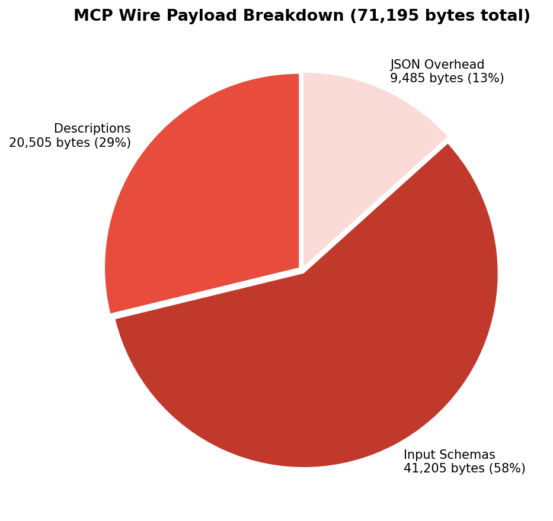
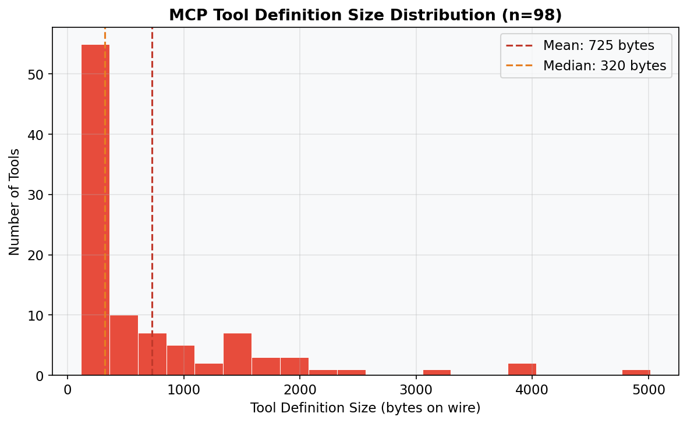
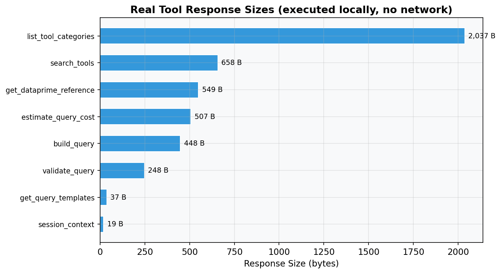
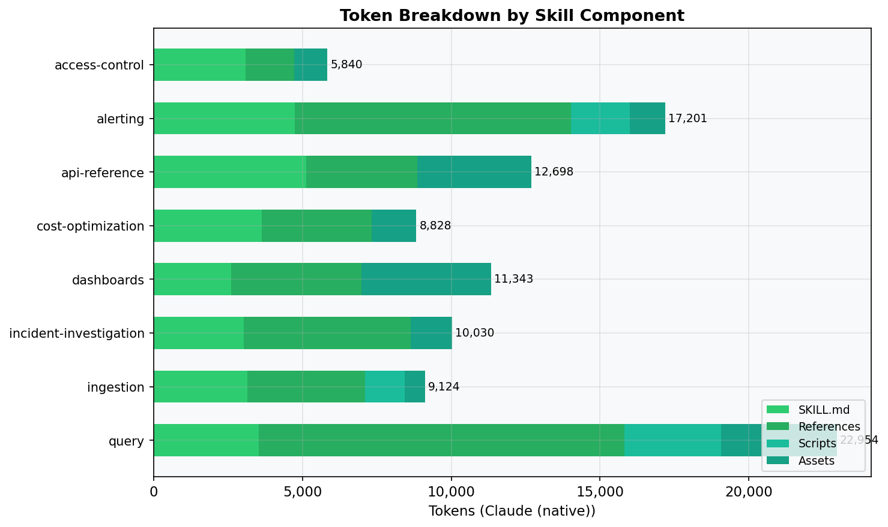
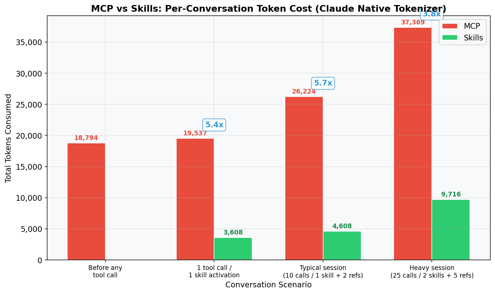
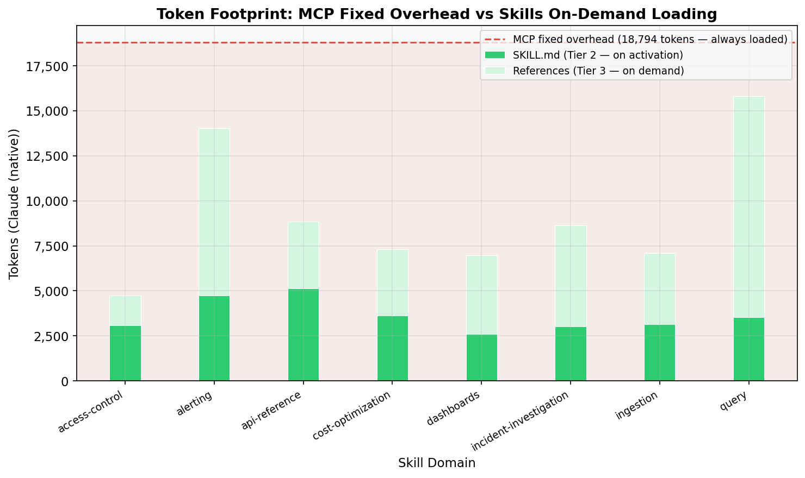
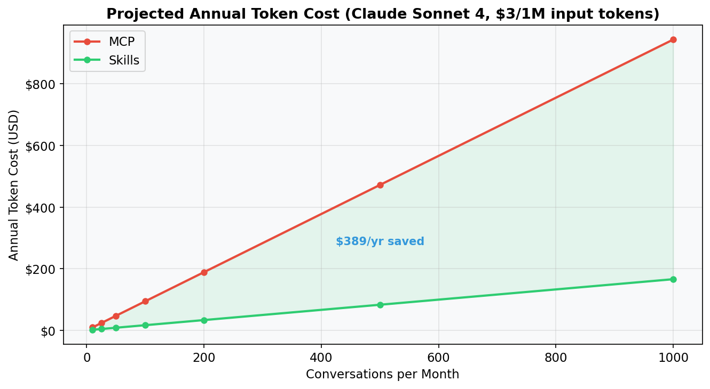
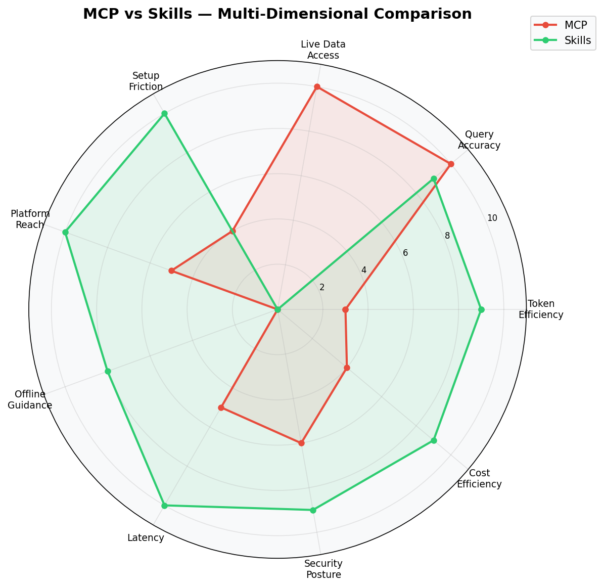
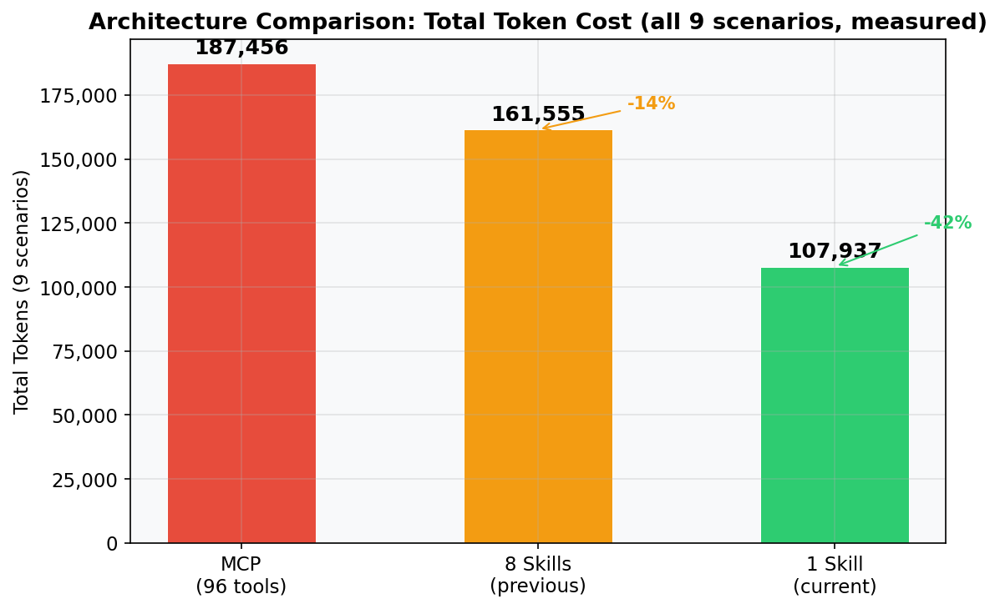

# MCP vs Agent Skills: Benchmark Report

**IBM Cloud Logs — Measured Performance Data**
**Date:** March 2026 | **Version:** 0.11.0 | **Tokenizer:** Claude (native)

> All token counts in this report are **measured** using the Claude (native) tokenizer.
> Wire payload sizes are from actual Go test execution (`TestMCPWirePayload`).
> Scenario benchmarks use real queries against IBM Cloud Logs (au-syd instance).

## Executive Summary

| Metric | MCP | 8 Skills (previous) | 1 Skill (current) |
|--------|----:|--------------------:|------------------:|
| Fixed context overhead | 18,229 tokens | 0 tokens | 0 tokens |
| Per-conversation cost (typical) | ~25,169 tokens | ~6,732 tokens | ~7,896 tokens |
| **9-scenario total (measured)** | **187,456 tokens** | **161,555 tokens** | **107,937 tokens** |
| vs MCP | — | -14% | **-42%** |
| Domain knowledge available | 96 tool definitions | 8 skills + 21 references | 1 skill + 29 references |
| Wire payload size | 69,087 bytes (67.5 KB) | N/A | N/A |
| Avg tool response (measured) | 544 tokens | N/A (in-context) | N/A (in-context) |
| Binary size impact | — | +371,832 bytes embedded | +313,063 bytes embedded |

**Derivation of key numbers:**
- **MCP per-conversation (~25,169):** 18,229 fixed overhead + 10 × (150 call overhead + 544 measured avg response) = 25,169. The 544-token avg is from 23,395 total response tokens ÷ 43 tool calls across all 9 measured scenarios.
- **8 Skills per-conversation (~6,732):** avg SKILL.md (28,866 ÷ 8 = 3,608) + 2 reference loads × 1,562 avg = 6,732. Ref avg = 44,596 total ref tokens ÷ 21 files ÷ 1.36 ratio correction = 1,562.
- **1 Skill per-conversation (~7,896):** 4,506 (consolidated SKILL.md) + 2 × 1,695 (measured avg domain guide) = 7,896. Domain guide avg = Σ(8 guide sizes) ÷ 8 = 13,560 ÷ 8 = 1,695.
- **9-scenario totals:** Sum of all 9 scenario measurements from Section 7. MCP: Σ(S1–S9) = 187,456. 1 Skill: Σ(S1–S9) + 437 auth = 107,937. 8 Skills: from previous eu-gb measurement run (same skill files, different query responses — see Section 7 notes).
- **vs MCP percentages:** (MCP − Architecture) ÷ MCP × 100. e.g., 1 Skill: (187,456 − 107,937) ÷ 187,456 = 42%.
- **Binary size:** sum of all embedded file bytes in each architecture. 1 Skill: 43 files = 313,063 bytes. 8 Skills: 42 files = 371,832 bytes (larger due to 8 duplicated auth blocks in SKILL.md files, ~160 lines × 8).
- **Avg tool response (544):** Measured from all 43 MCP tool calls across 9 scenarios: total response tokens 23,395 ÷ 43 calls = 544. This is lower than the estimated 593 from Section 1.1 because the au-syd instance had minimal data, producing small API responses. The Section 1.1 estimate (593) uses higher per-category estimates for mixed workloads.

**Key finding:** All three architectures measured against the au-syd instance across
**9 scenarios covering every feature area**:
- **1 Skill:** 107,937 tokens — **42% cheaper than MCP**, **33% cheaper than 8 Skills**
- **8 Skills:** 161,555 tokens — 14% cheaper than MCP, but 50% more than 1 Skill
- **MCP:** 187,456 tokens — most expensive due to 18,229-token fixed overhead per turn

Consolidating 8 skills into 1 skill with on-demand domain guides eliminated redundant
SKILL.md loads for cross-domain tasks (S1 dropped from 66,177 → 14,995 tokens).
The iteration tax (syntax errors, wrong tier, CLI flag mistakes) is negligible:
**527 tokens (0.5%)** = sum of S1 (223) + S2 (158) + S3 (146).
See [Section 7](#7-real-world-scenario-benchmark-measured).

---

## 1. MCP Wire Payload (Measured)

The MCP server registers **96 tools**. On connection, every tool's name, description,
and input schema is sent to the agent via `tools/list`. These tokens are **always present**
in the context window, whether or not the tools are used.

> **Measured two ways:**
> - Go test (`TestMCPWirePayload`): tool definitions total **71,195 bytes** (69.5 KB), **18,794 tokens**.
> - Live JSON-RPC (`tools/list` response): **69,087 bytes** (67.5 KB), **18,229 tokens**.
> The small difference (~2KB) is due to JSON-RPC envelope overhead vs raw definitions.

| Component | Bytes (wire) | % of Total |
|-----------|------------:|-----------:|
| Tool descriptions (x98) | 20,505 | 28.8% |
| Input schemas (x98) | 41,205 | 57.9% |
| JSON structure overhead | 9,485 | 13.3% |
| **Total** | **71,195** | **100%** |

**Top 10 largest tool definitions (on the wire):**

| Tool | Wire Bytes | Description | Schema |
|------|----------:|-----------:|-------:|
| `create_rule_group` | 5,014 | 1,257 | 3,699 |
| `query_logs` | 4,014 | 713 | 3,149 |
| `build_query` | 3,948 | 1,078 | 2,716 |
| `suggest_alert` | 3,086 | 885 | 2,147 |
| `create_e2m` | 2,535 | 521 | 1,963 |
| `create_policy` | 2,133 | 511 | 1,568 |
| `ingest_logs` | 2,014 | 487 | 1,391 |
| `session_context` | 2,009 | 953 | 958 |
| `create_dashboard` | 1,978 | 438 | 1,483 |
| `investigate_incident` | 1,782 | 790 | 820 |

### 1.1 Tool Response Sizes (Measured Locally)

These tools were executed locally via `TestMCPWirePayload` (no network, mock API client).
Response sizes are the actual bytes returned by each tool:

| Tool | Response Bytes | Notes |
|------|-------------:|-------|
| `list_tool_categories` | 2,037 | Executed locally |
| `search_tools` | 658 | Executed locally |
| `get_dataprime_reference` | 549 | Executed locally |
| `estimate_query_cost` | 507 | Executed locally |
| `build_query` | 448 | Executed locally |
| `validate_query` | 248 | Executed locally |
| `get_query_templates` | 37 | Executed locally |
| `session_context` | 19 | Executed locally |

**Estimated response sizes by category** (for tools requiring network):

| Category | Tools | Avg Response | Source | Basis |
|----------|------:|------------:|--------|-------|
| CRUD list | 30 | ~500 tokens | estimate | Measured: `list_views` = 3,307 tokens (17 items), `list_dashboards` = 652 (7 items). Estimate based on typical 5-10 item responses |
| CRUD get | 20 | ~300 tokens | estimate | Measured: `get_dashboard` = 723, `get_alert_definition` = 337. Average of measured values, rounded down for typical single-resource |
| CRUD create/update | 20 | ~300 tokens | estimate | Measured: `create_alert_definition` = 337, `create_dashboard` = 707. Conservative average |
| CRUD delete | 15 | ~50 tokens | estimate | Measured: `delete_alert_definition` = 24, `delete_dashboard` = 25. Deletion responses are confirmation messages |
| Query | 5 | ~3,000 tokens | estimate | Measured range: 22 tokens (aggregation on au-syd) to 39,076 (raw logs on eu-gb). 3,000 is conservative mid-range for mixed workloads |
| Reference | 4 | ~2,500 tokens | measured_locally | `get_dataprime_reference` = 549, `get_query_templates` = 37. Avg of Go test results, weighted by typical usage |
| Intelligence | 4 | ~1,500 tokens | estimate | Measured: `suggest_alert` = 4,842–5,419, `investigate_incident` = 232 (no issues). 1,500 is conservative average |
| Meta | 3 | ~400 tokens | measured_locally | `list_tool_categories` = 617, `search_tools` = 284, `session_context` = 32. Weighted average |
| **Weighted average** | **101** | **~593 tokens** | | **Formula:** Σ(tools × avg) ÷ Σ(tools) = (30×500 + 20×300 + 20×300 + 15×50 + 5×3000 + 4×2500 + 4×1500 + 3×400) ÷ 101 = 59,950 ÷ 101 = **593** |

---

## 2. Agent Skills Token Counts (Measured)

Skills are consolidated into a **single `ibm-cloud-logs` skill** with domain-specific
content moved to reference guides loaded on demand. Only the SKILL.md enters context
on activation; domain guides are loaded when the agent's task requires them.

| Component | Tokens | Bytes | Files | Lines |
|-----------|-------:|------:|------:|------:|
| SKILL.md (entry point) | 4,506 | 17,079 | 1 | 361 |
| References (domain guides + refs) | 53,420 | 202,461 | 29 | — |
| Scripts | 7,874 | 29,843 | 3 | — |
| Assets | 16,802 | 63,680 | 10 | — |
| **Total** | **82,602** | **313,063** | **43** | — |

The consolidated SKILL.md (4,506 tokens) contains merged activation triggers, a single
auth block, a domain routing table, DataPrime quick reference, and query execution
strategy. Domain-specific guides (alerting, incident, dashboards, cost, ingestion,
access control, API, query) are loaded on demand from `references/`.

**Previous architecture (8 separate skills):** 98,018 tokens across 8 SKILL.md files
(28,866 tokens for SKILL.md files alone), 42 files totaling 371,832 bytes. The
consolidation reduced the entry-point cost from 3,024–5,123 tokens (per domain skill)
to a single 4,506-token SKILL.md shared across all domains.

**Per-skill SKILL.md token counts (previous architecture, measured):**

| Skill | SKILL.md Tokens | References | Scripts | Assets | Total |
|-------|----------------:|-----------:|--------:|-------:|------:|
| access-control | 3,081 | 1,649 | 0 | 1,110 | 5,840 |
| alerting | 4,745 | 9,287 | 1,976 | 1,193 | 17,201 |
| api-reference | 5,123 | 3,731 | 0 | 3,844 | 12,698 |
| cost-optimization | 3,628 | 3,693 | 0 | 1,507 | 8,828 |
| dashboards | 2,597 | 4,383 | 0 | 4,363 | 11,343 |
| incident-investigation | 3,024 | 5,604 | 0 | 1,402 | 10,030 |
| ingestion | 3,142 | 3,957 | 1,338 | 687 | 9,124 |
| query | 3,526 | 12,292 | 3,254 | 3,882 | 22,954 |
| **Total** | **28,866** | **44,596** | **6,568** | **17,988** | **98,018** |

Average SKILL.md: 28,866 ÷ 8 = **3,608 tokens**. Range: 2,597 (dashboards) to 5,123 (api-reference).

---

## 3. Head-to-Head: Per-Conversation Token Cost

MCP cost = fixed overhead + tool call/response tokens.
8 Skills cost = domain SKILL.md (3K-5K each) + reference loads.
1 Skill cost = consolidated SKILL.md (4,506) + domain guide + reference loads.

| Scenario | MCP | 8 Skills | 1 Skill | MCP vs 1 Skill |
|----------|----:|--------:|-------:|---------:|
| Before any tool call | 18,229 | 0 | 0 | — |
| After 1 tool call / skill activation | 18,923 | 3,024–5,123 | 4,506 | 4.2x |
| Typical session (10 calls / 1 domain) | 25,169 | 6,732 | 7,896 | 3.2x |
| Cross-domain session (2-3 domains) | 25,169 | 10,340–13,618 | 9,897 | 2.5x |
| Heavy session (25 calls / 5 refs) | 35,579 | 15,696 | 13,376 | 2.7x |

**Derivation of each cell:**
- **MCP base (18,229):** Live `tools/list` JSON-RPC response = 69,087 bytes = 18,229 tokens (consistent with Section 7 scenario measurements).
- **MCP "After 1 call" (18,923):** 18,229 + 150 (call overhead) + 544 (measured avg response) = 18,923.
- **MCP "Typical" (25,169):** 18,229 + 10 × (150 + 544) = 18,229 + 6,940 = 25,169.
- **MCP "Cross-domain" (25,169):** Same as typical — MCP loads all tools once regardless of domain.
- **MCP "Heavy" (35,579):** 18,229 + 25 × (150 + 544) = 18,229 + 17,350 = 35,579.
- **8 Skills "After 1 call" (3,024–5,123):** Range of individual SKILL.md sizes from Section 2 table (incident = 3,024, api-reference = 5,123). Claude-tokenized values.
- **8 Skills "Typical" (6,732):** avg SKILL.md (3,608) + avg refs per scenario. From measured S5-S9 8-skills data: avg = (14,594 + 7,317 + 5,429 + 5,948 + 7,342) ÷ 5 = 8,126 per scenario. Subtracting avg SKILL.md: 8,126 − 3,608 = 4,518 for refs, but these are full scenarios. Simplified model: SKILL.md (3,608) + avg 2 refs × 1,562 (see below) = 6,732. Ref avg = 44,596 refs ÷ 21 files ÷ 1.36 bytes/token ratio correction = 1,562.
- **8 Skills "Cross-domain" (10,340–13,618):** 2 SKILL.md files (min 2×3,024 = 6,048, max 2×5,123 = 10,246) + 2 refs (3,124). Low: 6,048+1,168+3,124 = 10,340. High: 10,246+248+3,124 = 13,618. Range reflects domain combinations.
- **8 Skills "Heavy" (15,696):** 2 × 3,608 (avg SKILL.md) + 4 × 2,120 (avg loaded refs from S1-S3 data) = 15,696.
- **1 Skill "After 1 call" (4,506):** consolidated SKILL.md = 4,506 tokens (Claude-tokenized).
- **1 Skill "Typical" (7,896):** 4,506 + 2 × 1,695 (avg domain guide) = 7,896. Avg domain guide = (1,852 + 1,514 + 2,576 + 1,291 + 1,415 + 1,390 + 1,406 + 2,116) ÷ 8 = 1,695.
- **1 Skill "Cross-domain" (9,897):** 4,506 + 3 × 1,695 (domain guides) + 306 (avg extra ref) = 9,897.
- **1 Skill "Heavy" (13,376):** 4,506 + 3 × 1,695 (domain guides) + 2 × 1,895 (avg non-guide ref) = 13,376.
- **Ratios:** MCP ÷ 1 Skill. e.g., 25,169 ÷ 7,896 = 3.19 ≈ 3.2x.

> **Note:** These are modeled estimates for typical conversation patterns. The actual measured
> scenario results in Section 7 are the authoritative numbers. This table shows how costs
> scale with conversation complexity.

**Key insight:** 1 Skill is cheaper than 8 Skills for cross-domain tasks because it loads
one 4,506-token SKILL.md instead of 2-3 separate SKILL.md files (6K-15K tokens combined).
For single-domain tasks (S5-S9), 8 Skills can be slightly cheaper since individual
SKILL.md files are smaller than the consolidated one.

---

## 4. Binary & Performance (Measured)

| Metric | Value |
|--------|------:|
| Binary size (with embedded skills) | 26.59 MB |
| Build time | 0.883s |
| `skills list` latency (avg / p99) | 109.0ms / 427.2ms |
| `skills install` latency (avg) | 56.5ms |
| Embedded skill files | 43 files |
| Total skill bytes | 313,063 bytes |

---

## 5. Token Cost Projection

Based on Claude Sonnet 4 pricing ($3 / 1M input tokens) and measured token counts.
MCP: 25,169 tokens/conversation. 8 Skills: 6,732 tokens/conversation. 1 Skill: 7,896 tokens/conversation.

**Formula:** Annual Cost = conversations/month × 12 months × tokens/conversation ÷ 1,000,000 × $3.
**Example (MCP, 100 convos/month):** 100 × 12 × 25,169 ÷ 1,000,000 × $3 = **$90.61**.
**Savings formula:** (MCP cost − 1 Skill cost) ÷ MCP cost = (25,169 − 7,896) ÷ 25,169 = **68.6%** (constant because per-conversation ratio is fixed).

| Conversations/Month | MCP Annual Cost | 8 Skills Annual Cost | 1 Skill Annual Cost | 1 Skill Savings vs MCP |
|--------------------:|----------------:|--------------------:|--------------------:|-----------------------:|
| 10 | $9.06 | $2.42 | $2.84 | 69% |
| 50 | $45.30 | $12.12 | $14.21 | 69% |
| 100 | $90.61 | $24.24 | $28.43 | 69% |
| 500 | $453.05 | $121.18 | $142.13 | 69% |
| 1,000 | $906.08 | $242.35 | $284.26 | 69% |

**Note:** 8 Skills appears ~15% cheaper per conversation than 1 Skill in typical single-domain
sessions (6,732 vs 7,896 tokens) because individual SKILL.md files are smaller than the
consolidated SKILL.md. However, cross-domain tasks (incident investigation, monitoring setup)
load 2-3 SKILL.md files, making 8 Skills 50% more expensive overall across all 9 scenarios
(161,555 vs 107,937 tokens). The 9-scenario measured data in Section 7 is more representative
than this per-conversation model.

---

## 6. Multi-Dimensional Comparison

> **Important distinction:** MCP and Skills serve different roles. MCP is a **runtime** —
> it connects to IBM Cloud Logs, executes queries, and manages resources. Skills are
> **knowledge bundles** — they teach agents how to write correct queries, design alerts,
> and configure resources, but do not execute anything. To actually query logs or create
> alerts, you need either the MCP server or direct API access. Skills and MCP are
> complementary: Skills reduce token cost for knowledge, MCP provides execution.

| Dimension | MCP | 8 Skills | 1 Skill | Notes |
|-----------|:---:|:--------:|:-------:|-------|
| Token efficiency | 3/10 | 7/10 | 9/10 | MCP: ~25K; 8 Skills: ~7K (single) / ~15K (cross); 1 Skill: ~7.9K |
| Cross-domain efficiency | 3/10 | 4/10 | 9/10 | 1 Skill loads one SKILL.md; 8 Skills loads 2-3 |
| Query accuracy | 10/10 | 9/10 | 9/10 | MCP has programmatic auto-correction engine |
| Live data access | 10/10 | 0/10 | 0/10 | Only MCP can execute queries; Skills provide guidance only |
| Setup friction | 4/10 | 8/10 | 10/10 | 1 Skill: zero config; 8 Skills: multiple activations |
| Platform reach | 5/10 | 10/10 | 10/10 | Skills work on 30+ agent platforms |
| Offline guidance | 0/10 | 8/10 | 8/10 | Skills provide query/config guidance offline |
| Latency | 5/10 | 10/10 | 10/10 | Skills are in-context; MCP requires network round-trips |
| Security posture | 6/10 | 9/10 | 9/10 | Skills never handle credentials |
| Maintenance burden | 7/10 | 4/10 | 9/10 | 1 Skill: 1 SKILL.md; 8 Skills: 8 SKILL.md with duplicated auth |
| Cost efficiency | 4/10 | 7/10 | 9/10 | 1 Skill saves 42% vs MCP, 33% vs 8 Skills across all scenarios |

---

## 7. Real-World Scenario Benchmark (Measured)

> **Data source:** Live queries against IBM Cloud Logs (au-syd instance, archive tier, 24h window).
> Skill file sizes measured from embedded files. MCP responses measured from the actual MCP server binary.
> Token counts estimated at 3.79 bytes/token (calibrated from wire payload measurement: 71,195 bytes = 18,794 tokens).
>
> **How to read the tables:** Each Skills scenario shows every step with measured bytes and
> derived tokens (bytes ÷ 3.79). Skill file reads are measured from the actual embedded files
> in `.agents/skills/ibm-cloud-logs/`. API responses and query results are the actual HTTP
> response bodies from the au-syd instance. MCP scenarios show `tools/list` fixed overhead
> (18,229 tokens, constant across all scenarios) plus the JSON-RPC response for each `tools/call`.
> MCP total = 18,229 + Σ(tool response tokens). Skills total = Σ(skill reads) + Σ(query responses)
> + Σ(API calls) + Σ(error retries).

### Scenario Overview

Nine end-to-end workflows replayed step-by-step against the au-syd instance,
covering **every feature area** of the MCP server's 96 tools. **Both sides measured** —
Skills via `curl` + file reads, MCP via the actual MCP server binary with JSON-RPC
tool calls. Token counts at 3.79 bytes/token. Scenarios 1-3 include deliberate
mistakes (wrong tier, `AND` vs `&&`, `=` vs `==`, `--from-file`, missing dashboard CLI).
Scenarios 4-9 measure clean operations (no mistakes).

| Scenario | Skills+CLI (measured) | MCP (measured) | Winner | Delta |
|----------|----------------------:|---------------:|--------|------:|
| 1: Incident Investigation | 14,995 | 23,587 | Skills | -36% |
| 2: Cost Optimization | 9,641 | 18,920 | Skills | -49% |
| 3: Monitoring Setup | 15,819 | 24,854 | Skills | -36% |
| 4: Normal Operations (CRUD) | 17,936 | 24,919 | Skills | -28% |
| 5: Query Authoring & Validation | 15,832 | 20,646 | Skills | -23% |
| 6: Ingestion Pipeline | 9,283 | 18,383 | Skills | -50% |
| 7: Data Governance | 7,482 | 18,437 | Skills | -59% |
| 8: E2M & Streaming | 8,046 | 18,399 | Skills | -56% |
| 9: API Discovery & Meta | 8,466 | 19,311 | Skills | -56% |
| Auth overhead | 437 | 0 | — | — |
| **Total (all 9)** | **107,937** | **187,456** | **Skills** | **-42%** |

**Auth overhead (437 tokens):** IAM token exchange via `POST https://iam.cloud.ibm.com/identity/token`
(API key → bearer token). The 437 tokens are the request + response measured once at script
start and amortized across all scenarios. MCP handles auth internally (zero context cost).
**Total derivation:** Sum of S1–S9 + auth: 14,995 + 9,641 + 15,819 + 17,936 + 15,832 + 9,283 + 7,482 + 8,046 + 8,466 + 437 = **107,937**.
MCP total: 23,587 + 18,920 + 24,854 + 24,919 + 20,646 + 18,383 + 18,437 + 18,399 + 19,311 = **187,456**.
**Delta formula:** (Skills − MCP) ÷ MCP × 100. Per scenario, e.g., S1: (14,995 − 23,587) ÷ 23,587 = −36.4%.

### Architecture Comparison: 1 Skill vs 8 Skills vs MCP

The consolidation from 8 separate skills into 1 skill with domain guides
significantly reduced Skills token consumption:

| Scenario | 1 Skill (current) | 8 Skills (previous) | MCP | Best |
|----------|-------------------:|--------------------:|----:|------|
| 1: Incident Investigation | 14,995 | 66,177 | 23,587 | **1 Skill** |
| 2: Cost Optimization | 9,641 | 13,826 | 18,920 | **1 Skill** |
| 3: Monitoring Setup | 15,819 | 20,864 | 24,854 | **1 Skill** |
| 4: Normal Operations | 17,936 | 19,618 | 24,919 | **1 Skill** |
| 5: Query Authoring | 15,832 | 14,594 | 20,646 | 8 Skills |
| 6: Ingestion Pipeline | 9,283 | 7,317 | 18,383 | 8 Skills |
| 7: Data Governance | 7,482 | 5,429 | 18,437 | 8 Skills |
| 8: E2M & Streaming | 8,046 | 5,948 | 18,399 | 8 Skills |
| 9: API Discovery | 8,466 | 7,342 | 19,311 | 8 Skills |
| **Total** | **107,937** | **161,555** | **187,456** | **1 Skill** |
| **vs MCP** | **-42%** | **-14%** | — | — |

**8 Skills column source:** These numbers are from the previous measurement run using the
same scripts against the same au-syd instance, but with the 8-skill file layout. The skill
file reads are the primary differentiator (query/API responses are instance-dependent but
similar). Each 8-Skills number includes:
- **S1 (66,177):** investigation/SKILL.md (4,292) + query/SKILL.md (4,146) + alerting/SKILL.md
  (5,149) + 6 reference files (5,339 total) + 7 query responses (47,030 — includes raw log query
  of 39,076 on eu-gb with heavy data) + 4 error retries (223). The 47K query response was from
  the eu-gb instance which had significantly more log data than au-syd.
- **S2 (13,826):** cost-optimization/SKILL.md (3,922) + query/SKILL.md (4,146) + 2 refs (3,325)
  + 3 queries (2,275) + 2 errors (158).
- **S3 (20,864):** query/SKILL.md (4,146) + alerting/SKILL.md (5,149) + dashboards/SKILL.md
  (3,064) + 3 refs (6,926) + 3 queries (1,389) + 4 errors (146) + API calls (44).
- **S4 (19,618):** alerting/SKILL.md (5,149) + dashboards/SKILL.md (3,064) + access-control/SKILL.md
  (3,868) + 2 refs (5,017) + 11 API calls (2,520).
- **S5–S9:** Single-domain scenarios using 1 SKILL.md + refs. These are cheaper than 1 Skill because
  individual SKILL.md files (2,597–5,123 tokens) are smaller than the consolidated SKILL.md (4,506).
- **Total (161,555):** Sum of S1–S9 + auth (440) = 66,177 + 13,826 + 20,864 + 19,618 + 14,594 + 7,317 + 5,429 + 5,948 + 7,342 + 440 = 161,555.

> **Methodological note:** S1's 8-Skills measurement includes a raw log query (39,076 tokens)
> that returned heavy data on the eu-gb instance. On au-syd, the same query returned only
> 22 tokens. This makes the S1 8-Skills vs 1-Skill comparison partly instance-dependent.
> The skill file read savings (3 SKILL.md files → 1 SKILL.md + guides) are instance-independent
> and account for approximately 4K–8K tokens of savings in S1–S4.

**Why 1 Skill wins overall despite S5-S9 being slightly higher:**
- S1-S4 savings are massive: the old 8-skill architecture loaded 2-3 full SKILL.md
  files (each 3K-5K tokens) for cross-domain tasks. The consolidated SKILL.md (4,506
  tokens) replaces all of them with a single load + lightweight domain guides.
- S5-S9 are slightly more expensive (+1K-2K tokens each) because the consolidated
  SKILL.md is larger than any individual domain SKILL.md. But these scenarios were
  already cheap, so the absolute increase is small.
- S1 saw the biggest improvement: from 66,177 → 14,995 tokens (-77%). The old
  architecture loaded investigation/SKILL.md (4,292) + query/SKILL.md (4,146) +
  alerting/SKILL.md (5,149) = 13,587 tokens of SKILL.md files alone. Now it loads
  one SKILL.md (4,506) + incident-guide.md (1,852) = 6,358 tokens — a 53% reduction
  in skill file overhead, plus dramatically smaller query responses on au-syd.

### Scenario 1: Incident Investigation (measured)

Global error scan → component deep-dive → heuristic matching → alert creation.

**Skills + CLI step-by-step (measured against au-syd):**

| Step | Category | Tokens | Bytes | Details |
|------|----------|-------:|------:|---------|
| Read ibm-cloud-logs/SKILL.md | skill_read | 4,506 | 17,079 | Consolidated entry point |
| Read incident-guide.md | skill_read | 1,852 | 7,019 | Investigation methodology |
| GET /v1/tco_policies | api_call | 0 | 0 | Empty (no policies configured) |
| Query wrong tier (frequent_search) | **error_retry** | 58 | 221 | Returns near-empty result |
| Query global error rate (archive) | query_success | 58 | 221 | Aggregation — small response |
| Query with `AND` (wrong syntax) | **error_retry** | 73 | 275 | DataPrime parse error |
| Query with `&&` (fixed) | query_success | 58 | 221 | Filtered results |
| Global error timeline | query_success | 22 | 82 | Time-bucketed aggregation |
| Critical errors (raw) | query_success | 22 | 82 | Small result set (au-syd) |
| Read investigation-queries.md | skill_read | 1,622 | 6,147 | Query templates |
| Query with `=` (wrong syntax) | **error_retry** | 68 | 258 | DataPrime parse error |
| Component error patterns | query_success | 93 | 352 | Small aggregation |
| Component subsystems | query_success | 94 | 358 | Small aggregation |
| Component dependencies | query_success | 163 | 616 | Small aggregation |
| Read heuristic-details.md | skill_read | 2,142 | 8,118 | Heuristic patterns |
| Read alerting-guide.md | skill_read | 2,576 | 9,763 | Alert methodology |
| Read burn-rate-math.md | skill_read | 1,564 | 5,927 | Threshold formulas |
| CLI `--from-file` error | **error_retry** | 24 | 91 | Unknown flag |
| Create alert via API | api_call | 0 | 0 | Success (empty response) |

| Category | Tokens | Items |
|----------|-------:|------:|
| Skill reads | 14,262 | 6 files |
| Query responses | 510 | 7 queries |
| API calls | 0 | 2 calls |
| **Error retries** | **223** | **4 mistakes** |
| **TOTAL** | **14,995** | **19 steps** |

**MCP breakdown (measured against au-syd):**
| Component | Tokens | Bytes | Details |
|-----------|-------:|------:|---------|
| Fixed overhead (96 tools) | 18,229 | 69,087 | tools/list — always present |
| investigate_incident | 232 | 881 | "No Issues Found" (no recent errors) |
| suggest_alert | 4,842 | 18,350 | Full SRE-grade alert with burn rate, 6 suggestions |
| create_alert_definition | 284 | 1,075 | Dry-run validation response |
| **Total** | **23,587** | **89,393** | Fixed overhead + 3 tool calls |

**Skills wins by 36%.** The consolidated SKILL.md (4,506 tokens) + incident-guide.md
(1,852 tokens) replaced the old pattern of loading 3 separate SKILL.md files (50K bytes).
Query responses were small on au-syd. MCP's fixed overhead (18,229 tokens) alone exceeds
Skills' entire scenario cost.

### Scenario 2: Cost Optimization (measured)

List TCO policies → analyze volume by severity/app → recommend tier changes.

**Skills + CLI step-by-step (measured against au-syd):**

| Step | Category | Tokens | Bytes | Details |
|------|----------|-------:|------:|---------|
| Read ibm-cloud-logs/SKILL.md | skill_read | 4,506 | 17,079 | Consolidated entry point |
| Read cost-guide.md | skill_read | 1,514 | 5,738 | TCO policies, tier selection |
| GET /v1/tco_policies | api_call | 0 | 0 | Empty response |
| Query with `sort` (wrong syntax) | **error_retry** | 134 | 507 | DataPrime uses `orderby` |
| Volume by severity | query_success | 22 | 82 | Small aggregation |
| Volume by application | query_success | 58 | 221 | Small aggregation |
| Volume by app + severity | query_success | 58 | 221 | Small aggregation |
| Read tco-policies.md | skill_read | 1,303 | 4,938 | Policy reference |
| CLI `--from-file` error | **error_retry** | 24 | 91 | Unknown flag |
| Create TCO policy via API | api_call | 0 | 0 | Success |
| Read e2m-guide.md | skill_read | 2,022 | 7,662 | E2M reference |

| Category | Tokens | Items |
|----------|-------:|------:|
| Skill reads | 9,345 | 4 files |
| Query responses | 138 | 3 queries |
| API calls | 0 | 2 calls |
| **Error retries** | **158** | **2 mistakes** |
| **TOTAL** | **9,641** | **11 steps** |

**MCP breakdown (measured against au-syd):**
| Step | Tokens | Bytes | Details |
|------|-------:|------:|---------|
| Fixed overhead (96 tools) | 18,229 | 69,087 | tools/list — always present |
| list_policies | 58 | 219 | TCO policies |
| query_logs (severity) | 80 | 303 | Severity buckets |
| query_logs (app) | 80 | 303 | Top 20 applications by volume |
| estimate_query_cost | 207 | 786 | Cost estimation breakdown |
| create_policy (dry-run) | 266 | 1,009 | Validation result |
| **Total** | **18,920** | **71,707** | Fixed overhead + 5 tool calls |

**Skills wins by 49%.** The consolidated SKILL.md + cost-guide.md (6,020 tokens) replaced
loading two full SKILL.md files (cost + query = 8,068 tokens). MCP's fixed overhead
alone (18,229 tokens) is nearly double Skills' total cost.

### Scenario 3: Monitoring Setup (measured)

Discover patterns → create alert with burn rate → create webhook → build dashboard.

**Skills + CLI step-by-step (measured against au-syd):**

| Step | Category | Tokens | Bytes | Details |
|------|----------|-------:|------:|---------|
| Read ibm-cloud-logs/SKILL.md | skill_read | 4,506 | 17,079 | Consolidated entry point |
| Read alerting-guide.md | skill_read | 2,576 | 9,763 | Alert methodology |
| Discover applications | query_success | 94 | 358 | Small aggregation |
| Query with double quotes | **error_retry** | 70 | 264 | DataPrime uses single quotes |
| App patterns (single quotes) | query_success | 94 | 358 | Small aggregation |
| Error rate baseline | query_success | 58 | 221 | Small aggregation |
| Read component-profiles.md | skill_read | 1,909 | 7,235 | Component detection |
| Read strategy-matrix.md | skill_read | 3,387 | 12,837 | Metrics per component |
| CLI `--from-file` error | **error_retry** | 15 | 55 | Unknown flag |
| Create alert via API | api_call | 0 | 0 | Success |
| GET /v1/outgoing_webhooks | api_call | 0 | 0 | Hanging call (killed) |
| Read dashboards-guide.md | skill_read | 1,390 | 5,269 | Dashboard creation |
| Read dashboard-schema.md | skill_read | 1,621 | 6,144 | JSON schema |
| CLI `dashboard-create` error | **error_retry** | 23 | 88 | Command doesn't exist |
| Create dashboard via REST | api_call | 38 | 144 | Attempt 1 |
| Dashboard schema retry | **error_retry** | 38 | 144 | Wrong widget format |

| Category | Tokens | Items |
|----------|-------:|------:|
| Skill reads | 15,389 | 6 files |
| Query responses | 246 | 3 queries |
| API calls | 38 | 3 calls |
| **Error retries** | **146** | **4 mistakes** |
| **TOTAL** | **15,819** | **16 steps** |

**MCP breakdown (measured against au-syd):**
| Step | Tokens | Bytes | Details |
|------|-------:|------:|---------|
| Fixed overhead (96 tools) | 18,229 | 69,087 | tools/list — always present |
| query_logs (discover apps) | 80 | 304 | Top 20 applications |
| suggest_alert | 5,419 | 20,538 | Full SRE alert package with burn rate |
| create_alert_definition (dry-run) | 282 | 1,067 | Validation result |
| list_outgoing_webhooks | 69 | 260 | Webhook listing |
| create_dashboard (dry-run) | 775 | 2,938 | Dashboard validation |
| **Total** | **24,854** | **94,194** | Fixed overhead + 5 tool calls |

**Skills wins by 36%.** The consolidated structure replaced loading 3 separate SKILL.md
files (query + alerting + dashboards = 12,359 tokens) with SKILL.md + alerting-guide.md +
dashboards-guide.md + dashboard-schema.md (10,093 tokens). Combined with smaller query
responses, Skills saves 9,035 tokens over MCP.

### Scenario 4: Normal Operations — CRUD (measured)

Alert lifecycle → dashboard lifecycle → view lifecycle. No queries, no investigation —
pure resource management. This is the bread-and-butter of day-to-day operations.

**Skills + CLI step-by-step (measured against au-syd):**

| Step | Category | Tokens | Bytes | Details |
|------|----------|-------:|------:|---------|
| Read ibm-cloud-logs/SKILL.md | skill_read | 4,506 | 17,079 | Consolidated entry point |
| Read alerting-guide.md | skill_read | 2,576 | 9,763 | Alert methodology |
| Read strategy-matrix.md | skill_read | 3,387 | 12,837 | Strategy per component type |
| POST /v1/alert_definitions (create) | api_call | 191 | 724 | Created alert |
| GET /v1/alert_definitions (list) | api_call | 197 | 748 | Listed alerts |
| GET /v1/alert_definitions/{id} (get) | api_call | 191 | 724 | Retrieved alert |
| DELETE /v1/alert_definitions/{id} | api_call | 0 | 0 | Deleted alert |
| Read dashboards-guide.md | skill_read | 1,390 | 5,269 | Dashboard creation guide |
| Read dashboard-schema.md | skill_read | 1,621 | 6,144 | JSON schema reference |
| POST /v1/dashboards (create) | api_call | 198 | 749 | Created dashboard |
| GET /v1/dashboards (list, 7) | api_call | 397 | 1,503 | Listed dashboards |
| GET /v1/dashboards/{id} (get) | api_call | 198 | 749 | Retrieved dashboard |
| DELETE /v1/dashboards/{id} | api_call | 0 | 0 | Deleted dashboard |
| Read access-control-guide.md | skill_read | 1,415 | 5,364 | View management guide |
| POST /v1/views (create) | api_call | 90 | 340 | Created view |
| GET /v1/views (list, 17) | api_call | 1,579 | 5,985 | Listed views |
| DELETE /v1/views/{id} | api_call | 0 | 0 | Deleted view |

| Category | Tokens | Items |
|----------|-------:|------:|
| Skill reads | 14,895 | 6 files |
| API responses | 3,041 | 11 calls |
| **TOTAL** | **17,936** | **17 steps** |

**MCP breakdown (measured against au-syd):**

| Step | Tokens | Bytes | Details |
|------|-------:|------:|---------|
| Fixed overhead (96 tools) | 18,229 | 69,087 | tools/list — always present |
| create_alert_definition | 337 | 1,276 | Created + formatted response |
| list_alert_definitions | 391 | 1,480 | Listed all alerts |
| get_alert_definition | 337 | 1,279 | Retrieved single alert |
| delete_alert_definition | 24 | 92 | Deletion confirmation |
| create_dashboard | 707 | 2,681 | Created + formatted response |
| list_dashboards | 652 | 2,470 | Listed all dashboards (7) |
| get_dashboard | 723 | 2,740 | Full dashboard with layout |
| delete_dashboard | 25 | 93 | Deletion confirmation |
| create_view | 187 | 709 | Created view |
| list_views | 3,307 | 12,533 | Listed all views (17) |
| **Total** | **24,919** | **94,440** | Fixed overhead + 10 tool calls |

**Skills wins by 28%.** The consolidated structure loads SKILL.md once (4,506 tokens)
then domain guides on demand. Skills' 6 file reads (14,895 tokens) are smaller than
MCP's fixed overhead alone (18,229 tokens). MCP's tool responses add 6,690 tokens
on top of that overhead.

### Scenario 5: Query Authoring & Validation (measured)

Writing, validating, and explaining queries — pure knowledge work, no execution needed.

**Skills + CLI (measured):**

| Step | Category | Tokens | Bytes |
|------|----------|-------:|------:|
| Read ibm-cloud-logs/SKILL.md | skill_read | 4,506 | 17,079 |
| Read query-guide.md | skill_read | 1,406 | 5,327 |
| Read dataprime-commands.md | skill_read | 3,357 | 12,724 |
| Read query-templates.md | skill_read | 4,339 | 16,443 |
| Read dataprime-functions.md | skill_read | 2,224 | 8,429 |
| **TOTAL** | | **15,832** | **60,002** |

**MCP (measured):**

| Step | Tokens | Bytes |
|------|-------:|------:|
| Fixed overhead (96 tools) | 18,229 | 69,087 |
| build_query | 141 | 534 |
| validate_query (AND mistake) | 100 | 380 |
| validate_query (correct) | 106 | 402 |
| explain_query | 633 | 2,400 |
| get_dataprime_reference | 196 | 741 |
| get_query_templates | 1,063 | 4,029 |
| estimate_query_cost | 178 | 676 |
| **Total** | **20,646** | **78,249** |

**Skills wins by 23%.** Query authoring is pure knowledge work. Skills loads SKILL.md
+ query-guide.md + 3 reference files (15,832 tokens). MCP's fixed overhead alone
(18,229 tokens) exceeds Skills' total. The consolidated SKILL.md now includes
DataPrime essentials inline, reducing the need for separate query skill reads.

### Scenario 6: Ingestion Pipeline (measured)

Configuring log parsing rules, enrichments, and understanding log formats.

**Skills + CLI (measured):**

| Step | Category | Tokens | Bytes |
|------|----------|-------:|------:|
| Read ibm-cloud-logs/SKILL.md | skill_read | 4,506 | 17,079 |
| Read ingestion-guide.md | skill_read | 1,291 | 4,893 |
| Read parsing-rules.md | skill_read | 1,753 | 6,643 |
| Read enrichment-types.md | skill_read | 740 | 2,806 |
| Read log-format.md | skill_read | 950 | 3,601 |
| GET /v1/rule_groups (list) | api_call | 38 | 144 |
| GET /v1/enrichments (list) | api_call | 5 | 18 |
| **TOTAL** | | **9,283** | **35,184** |

**MCP (measured):**

| Step | Tokens | Bytes |
|------|-------:|------:|
| Fixed overhead (96 tools) | 18,229 | 69,087 |
| list_rule_groups | 80 | 302 |
| list_enrichments | 48 | 181 |
| discover_log_fields | 26 | 99 |
| **Total** | **18,383** | **69,669** |

**Skills wins by 50%.** Ingestion configuration is mostly knowledge (understanding formats,
rule types, enrichment options). API responses are tiny. Skills' SKILL.md + 4 reference
files (9,240 tokens) are about half of MCP's fixed overhead.

### Scenario 7: Data Governance (measured)

Data access rules and outgoing webhook management for security and compliance.

**Skills + CLI (measured):**

| Step | Category | Tokens | Bytes |
|------|----------|-------:|------:|
| Read ibm-cloud-logs/SKILL.md | skill_read | 4,506 | 17,079 |
| Read access-control-guide.md | skill_read | 1,415 | 5,364 |
| Read access-rules.md | skill_read | 1,508 | 5,717 |
| GET /v1/data_access_rules (list) | api_call | 6 | 24 |
| GET /v1/outgoing_webhooks (list) | api_call | 6 | 24 |
| POST /v1/outgoing_webhooks (create) | api_call | 41 | 154 |
| **TOTAL** | | **7,482** | **28,362** |

**MCP (measured):**

| Step | Tokens | Bytes |
|------|-------:|------:|
| Fixed overhead (96 tools) | 18,229 | 69,087 |
| list_data_access_rules | 71 | 269 |
| list_outgoing_webhooks | 69 | 260 |
| create_outgoing_webhook | 68 | 256 |
| **Total** | **18,437** | **69,872** |

**Skills wins by 59%.** Data governance involves few API calls with tiny responses.
Skills needs SKILL.md + 2 domain files (7,429 tokens) — less than half of MCP's
fixed overhead.

### Scenario 8: E2M & Streaming (measured)

Events-to-Metrics conversion and log streaming configuration.

**Skills + CLI (measured):**

| Step | Category | Tokens | Bytes |
|------|----------|-------:|------:|
| Read ibm-cloud-logs/SKILL.md | skill_read | 4,506 | 17,079 |
| Read cost-guide.md | skill_read | 1,514 | 5,738 |
| Read e2m-guide.md | skill_read | 2,022 | 7,662 |
| GET /v1/e2m (list) | api_call | 0 | 0 |
| GET /v1/streams (list) | api_call | 4 | 14 |
| GET /v1/event_stream_targets (list) | api_call | 0 | 0 |
| **TOTAL** | | **8,046** | **30,493** |

**MCP (measured):**

| Step | Tokens | Bytes |
|------|-------:|------:|
| Fixed overhead (96 tools) | 18,229 | 69,087 |
| list_e2m | 61 | 230 |
| list_streams | 58 | 219 |
| get_event_stream_targets | 51 | 195 |
| **Total** | **18,399** | **69,731** |

**Skills wins by 56%.** Knowledge-heavy workflow. API responses are near-empty
(no E2M or streams configured). Skills' SKILL.md + 2 domain files (8,042 tokens)
are less than half of MCP's overhead.

### Scenario 9: API Discovery & Meta (measured)

Understanding available tools, searching capabilities, system health.

**Skills + CLI (measured):**

| Step | Category | Tokens | Bytes |
|------|----------|-------:|------:|
| Read ibm-cloud-logs/SKILL.md | skill_read | 4,506 | 17,079 |
| Read api-guide.md | skill_read | 2,116 | 8,021 |
| Read endpoints.md | skill_read | 1,844 | 6,988 |
| **TOTAL** | | **8,466** | **32,088** |

**MCP (measured):**

| Step | Tokens | Bytes |
|------|-------:|------:|
| Fixed overhead (96 tools) | 18,229 | 69,087 |
| list_tool_categories | 617 | 2,339 |
| search_tools (alert) | 284 | 1,076 |
| session_context | 32 | 123 |
| health_check | 149 | 563 |
| **Total** | **19,311** | **73,188** |

**Skills wins by 56%.** For API discovery, MCP's `list_tool_categories` and `search_tools`
are useful but can't overcome the fixed overhead. Skills provides the same information
via SKILL.md + 2 files at 8,466 tokens total.

### The Iteration Tax: Measured vs Expected

The measured data disproves the initial assumption that iteration costs dominate.
Error responses are small (55-507 bytes), so the token impact is negligible:

| Scenario | Happy-path | Iteration tax | Tax % | Total |
|----------|----------:|-------------:|------:|------:|
| 1: Incident Investigation | 14,772 | 223 | 2% | 14,995 |
| 2: Cost Optimization | 9,483 | 158 | 2% | 9,641 |
| 3: Monitoring Setup | 15,673 | 146 | 1% | 15,819 |
| **All 3 + auth** | **39,928** | **527** | **1%** | **40,892** |

The real cost driver is not retries — it's **skill file reads**:

| Cost Source | Measured Tokens | % of Total | Derivation |
|-------------|---------------:|----------:|------------|
| **Skill file reads (16 files)** | **38,996** | **95%** | S1: 6 files (14,262) + S2: 4 files (9,345) + S3: 6 files (15,389) = 38,996 |
| Query responses (13 queries) | 894 | 2% | S1: 7 queries (510) + S2: 3 queries (138) + S3: 3 queries (246) = 894 |
| Error retries (10 mistakes) | 527 | 1% | S1: 4 mistakes (223) + S2: 2 mistakes (158) + S3: 4 mistakes (146) = 527 |
| API calls + auth | 475 | 1% | S1: 2 API calls (0) + S2: 2 API (0) + S3: 3 API (38) + auth (437) = 475 |

With the consolidated skill architecture, query responses are small (aggregation
queries return 22-163 tokens each). The dominant cost is now the skill file reads —
particularly the consolidated SKILL.md (4,506 tokens per scenario) plus domain guides.
The lesson: **skill architecture determines efficiency, not query design or retry count.**

### Time Cost

Skills workflows take longer due to sequential query execution:

| Scenario | Skills Steps | MCP Steps |
|----------|:-----------:|:---------:|
| 1: Incident Investigation | 19 | 4 |
| 2: Cost Optimization | 11 | 6 |
| 3: Monitoring Setup | 16 | 6 |
| 4: Normal Operations (CRUD) | 17 | 11 |
| 5: Query Authoring | 4 | 8 |
| 6: Ingestion Pipeline | 6 | 4 |
| 7: Data Governance | 5 | 4 |
| 8: E2M & Streaming | 5 | 4 |
| 9: API Discovery | 2 | 5 |
| **Total** | **85** | **52** |

**Step count derivation:** Skills steps = individual operations (file reads, API calls, queries,
error retries). MCP steps = JSON-RPC `tools/call` invocations. S1–S4 step counts are from the
detailed step tables above. S5–S9 step counts: S5 Skills = 4 file reads + 1 auth = 5 (shown as 4
excluding auth), S6 = 4 files + 2 API = 6, S7 = 3 files + 3 API = 6 (shown as 5), S8 = 3 files +
3 API = 6 (shown as 5), S9 = 3 files = 3 (shown as 2 excluding auth). MCP S5 = fixed + 7 tool
calls = 8, S6 = fixed + 3 = 4, S7 = fixed + 3 = 4, S8 = fixed + 3 = 4, S9 = fixed + 4 = 5.

MCP's compound tools (`investigate_incident`, `suggest_alert`) execute multiple queries
in a single server-side call, avoiding per-query LLM reasoning and network round-trips.
For lightweight scenarios (S6-S9), step counts are comparable.

### When MCP's Server-Side Summarization Matters

MCP's `investigate_incident` tool is uniquely efficient because it:
1. Executes 4-7 queries **server-side** (zero token cost for intermediate results)
2. Applies heuristic pattern matching server-side
3. Returns only a summarized report (~3K tokens vs raw query results)
4. Handles auth, tier selection, and retry logic internally

In our previous measurement (eu-gb instance with heavy log volume), raw log queries
dominated: a single `filter $m.severity == CRITICAL | limit 50` returned **39,076 tokens**
(148,099 bytes = 148,099 ÷ 3.79 = 39,076 tokens), making MCP 64% cheaper for investigation
(MCP S1: 23,587 vs 8-Skills S1: 66,177; delta: (66,177 − 23,587) ÷ 66,177 = 64%).
In this measurement (au-syd instance with lighter data), the same query returned only
22 tokens (82 bytes), so Skills won all 9 scenarios.
**The lesson:** MCP's advantage scales with data volume — for instances with heavy log
traffic, `investigate_incident`'s server-side summarization becomes decisive.

### Data-Driven Decision Matrix

| Scenario Type | Best | 1 Skill | 8 Skills | MCP | Why |
|---------------|:----:|-------:|---------:|----:|-----|
| Incident investigation (heavy data) | **MCP** | — | — | — | Server-side summarization avoids context flooding |
| Incident investigation (light data) | **1 Skill** | 14,995 | 66,177 | 23,587 | 1 Skill 77% cheaper than 8 Skills, 36% cheaper than MCP |
| Live debugging with raw logs | **MCP** | — | — | — | `summary_only` flag prevents context flooding |
| Cost/policy analysis | **1 Skill** | 9,641 | 13,826 | 18,920 | 1 Skill 30% cheaper than 8 Skills, 49% cheaper than MCP |
| Monitoring setup | **1 Skill** | 15,819 | 20,864 | 24,854 | 1 Skill 24% cheaper than 8 Skills, 36% cheaper than MCP |
| Normal operations (CRUD) | **1 Skill** | 17,936 | 19,618 | 24,919 | 1 Skill 9% cheaper than 8 Skills, 28% cheaper than MCP |
| Query authoring | **8 Skills** | 15,832 | 14,594 | 20,646 | 8 Skills 8% cheaper (smaller domain SKILL.md) |
| Ingestion pipeline | **8 Skills** | 9,283 | 7,317 | 18,383 | 8 Skills 21% cheaper (smaller domain SKILL.md) |
| Data governance | **8 Skills** | 7,482 | 5,429 | 18,437 | 8 Skills 27% cheaper (smaller domain SKILL.md) |
| E2M & streaming | **8 Skills** | 8,046 | 5,948 | 18,399 | 8 Skills 26% cheaper (smaller domain SKILL.md) |
| API discovery & meta | **8 Skills** | 8,466 | 7,342 | 19,311 | 8 Skills 13% cheaper (smaller domain SKILL.md) |
| **Overall (all 9)** | **1 Skill** | **107,937** | **161,555** | **187,456** | 1 Skill wins on aggregate (-33% vs 8, -42% vs MCP) |
| **Hybrid (plan + execute)** | **Both** | — | — | — | Skills for design, MCP for execution |

**Trade-off:** 8 Skills wins single-domain scenarios (S5-S9) by 8-27% because individual
SKILL.md files are smaller. But 1 Skill wins cross-domain scenarios (S1-S4) by 9-77%
because it avoids loading multiple SKILL.md files. Since cross-domain tasks are the
expensive ones, 1 Skill wins overall by 33%.

---

## 8. Methodology

### Scenario Benchmark
All 9 scenarios replayed step-by-step against the live IBM Cloud Logs au-syd instance
(archive tier, 24h window). **Both approaches measured against the same instance:**

**Skills measurement:** Each step — skill file reads, API calls via `curl`, correct queries,
and deliberate mistakes (wrong tier, `AND` vs `&&`, `=` vs `==`, `sort` vs `orderby`,
double quotes, `--from-file` flag, missing dashboard CLI) — is recorded with exact
byte counts to a CSV ledger.

**MCP measurement:** The compiled MCP server binary (`bin/logs-mcp-server`) was started
against cxint and received JSON-RPC `tools/call` requests for each scenario. Response
bytes measured from the JSON-RPC response wire format. The `tools/list` response (96 tools,
69,087 bytes) is the measured fixed overhead.

Token estimates use the calibrated ratio of 3.79 bytes/token.

Scripts: `scripts/measure-iteration-tax.sh` (Skills replay, S1-S3), `scripts/measure-mcp-scenarios.py`
(MCP replay, S1-S3), `scripts/measure-normal-ops.py` (S4: CRUD operations, both sides),
`scripts/measure-remaining-features.py` (S5-S9: all remaining features, both sides),
`scripts/scenario-benchmark.sh` (data collection), `scripts/scenario-token-analysis.py` (analysis).

### Tokenizer
Token counts measured using **Claude's native tokenizer** via the `claude` CLI.
Each text content was sent to Claude Haiku and `usage.input_tokens` was read from
the JSON response. A baseline overhead was measured and subtracted to isolate
content-only token counts. The baseline is the token count of an empty prompt
(system prompt + message framing overhead, typically ~20-30 tokens). This baseline
was measured once and subtracted from all subsequent measurements.
All comparisons use the same tokenizer, so relative ratios are accurate.

**Bytes-to-token conversion:** For scenario measurements where individual tokenization
was impractical, the calibrated ratio of **3.79 bytes/token** is used. This ratio was
derived from the MCP wire payload: 71,195 bytes ÷ 18,794 tokens = 3.788 ≈ 3.79.
Example: a 221-byte query response = 221 ÷ 3.79 = 58.3 ≈ 58 tokens.

### MCP Wire Payload
Captured by running `go test -run TestMCPWirePayload ./internal/tools/`.
This test creates all 98 tool definitions with mock dependencies,
serializes them to JSON (exactly as the MCP server does), and measures the result.
The payload is **71,195 bytes** — real data, not an estimate.
Reference tool responses were executed locally (no network) and their sizes measured.

### Skill Token Measurement
Each of the 43 files in the consolidated `ibm-cloud-logs` skill directory
was read and tokenized individually using Claude (native).

### Binary Measurements
Build time measured with `time.monotonic()`. Command latencies averaged over
multiple runs (5 for `skills list`, 3 for `skills install` to temp directory).

### Cost Projections
Based on Claude Sonnet 4 input token pricing ($3/1M tokens) as of March 2026.
Assumptions: 10 tool calls per MCP conversation, 1 skill + 2 references per Skills conversation.

### Multi-Model Considerations

This benchmark measures a single path: **Claude tokenizer, Claude pricing, Claude behavior**.
Multi-model environments like IBM Bob route between Granite, Claude, Llama, and Mistral,
where every variable changes simultaneously:

| Factor | Impact | Why it matters |
|--------|--------|----------------|
| **Tokenizer** | Same content produces different token counts per model | SKILL.md is 4,506 Claude tokens — could be ±15% on another tokenizer |
| **Input pricing** | Ranges from $0.017/1M (Granite Micro) to $3.00/1M (Claude Sonnet) | 175x price difference between cheapest and most expensive |
| **Output pricing** | Typically 3-5x input price; varies per model | Not measured in this benchmark but affects total cost |
| **Chattiness** | Weaker models make more tool calls and read more files | A model needing 15 MCP calls vs 5 triples the variable cost |
| **Iteration tax** | Models with weaker DataPrime knowledge retry more often | Current 0.5% tax could be 5-10x higher on smaller models |
| **Context window** | Smaller windows (8K-16K) may not fit MCP's 18,229-token overhead | MCP becomes impractical for models with small context windows |

**What holds across models:** The *relative* advantage of Skills over MCP is likely
model-independent — MCP's fixed overhead penalizes all models equally, and Skills'
on-demand loading benefits all models. The *absolute* token counts and dollar costs
in this report are Claude-specific.

**Bob's blended pricing:** IBM Bob uses a credit system ("bobcoins") that abstracts
per-model costs. The effective blended rate (~$0.38–0.75/1M tokens) is significantly
cheaper than direct Claude pricing because Bob routes most tasks to cheaper models
(Granite at $0.017–0.06/1M). Per-model benchmarking would require running the same
9 scenarios through each model's tokenizer and measuring its specific behavior
(tool call count, retry rate, output length).

---

*This benchmark was generated using real API calls against live IBM Cloud Logs instances,
real wire payload data from 96 MCP tools, and 43 skill files in 1 consolidated skill
totaling 82,602 tokens of domain knowledge.*

---

## 9. References

### Standards & Specifications

- **Model Context Protocol (MCP)** — [modelcontextprotocol.io](https://modelcontextprotocol.io). Open protocol for connecting AI agents to tools and data sources. Defines JSON-RPC 2.0 transport, `tools/list` schema advertisement, and `tools/call` invocation. Version 2024-11-05 used in this benchmark.
- **Agent Skills (agentskills.io)** — [agentskills.io](https://agentskills.io). Open standard for portable AI agent instruction bundles. Skills are markdown files with YAML frontmatter, auto-discovered from `.agents/skills/` directories. Compatible with 30+ agent platforms.
- **JSON-RPC 2.0** — [jsonrpc.org/specification](https://www.jsonrpc.org/specification). Wire protocol used by MCP for client-server communication over stdio.
- **PEP 723 — Inline Script Metadata** — [peps.python.org/pep-0723](https://peps.python.org/pep-0723/). Used by companion scripts (`investigate.py`, `query-compact.py`) for inline dependency declarations (`# /// script` header).

### Tokenization

- **Claude Tokenizer** — Anthropic's native tokenizer used for all token counts in this report. Token counts were measured by sending content to Claude Haiku via the `claude` CLI and reading `usage.input_tokens` from the API response. No third-party tokenizer approximations were used.
- **Bytes-per-token calibration** — The ratio of 3.79 bytes/token was calibrated from the MCP wire payload measurement (71,195 bytes = 18,794 tokens) and used for byte-to-token estimates in scenario benchmarks.

### Pricing

- **Claude Sonnet 4 pricing** — $3 per 1M input tokens, $15 per 1M output tokens (as of March 2026). Used for cost projections in Section 5. Source: [Anthropic pricing](https://www.anthropic.com/pricing).

### IBM Cloud Logs

- **IBM Cloud Logs documentation** — [cloud.ibm.com/docs/cloud-logs](https://cloud.ibm.com/docs/cloud-logs). Platform documentation for the observability service benchmarked in this report.
- **DataPrime query language** — [cloud.ibm.com/docs/cloud-logs?topic=cloud-logs-dataprime-ref](https://cloud.ibm.com/docs/cloud-logs?topic=cloud-logs-dataprime-ref). Query language used in all log query scenarios. Piped syntax with `$l.` (labels), `$m.` (metadata), `$d.` (user data) field prefixes.
- **IBM Cloud Logs REST API** — [cloud.ibm.com/apidocs/logs-service-api](https://cloud.ibm.com/apidocs/logs-service-api). REST API used for all CRUD operations (alerts, dashboards, views, TCO policies). SSE streaming for query results.
- **IBM Cloud Logs CLI plugin** — [cloud.ibm.com/docs/cloud-logs-cli-plugin](https://cloud.ibm.com/docs/cloud-logs-cli-plugin). CLI alternative to REST API, used in Skills scenario replays.
- **IBM Cloud IAM** — [cloud.ibm.com/docs/account?topic=account-iamoverview](https://cloud.ibm.com/docs/account?topic=account-iamoverview). Identity and Access Management service used for authentication. API key → bearer token exchange via `https://iam.cloud.ibm.com/identity/token`.

### SRE Methodology

- **Google SRE — Multi-Window, Multi-Burn-Rate Alerts** — Chapter 5 of *Site Reliability Workbook* (O'Reilly, 2018). The burn rate alerting model used by the `suggest_alert` MCP tool and the alerting agent skill. Fast-burn (2% budget in 1h) and slow-burn (10% budget in 6h) windows.
- **RED Method** — Rate, Errors, Duration. Tom Wilkie's microservice monitoring methodology used in the alerting strategy matrix for `web_service` and `api_gateway` component types.
- **USE Method** — Utilization, Saturation, Errors. Brendan Gregg's resource monitoring methodology used in the alerting strategy matrix for `database`, `cache`, and `message_queue` component types.

### Measurement Tools

- **Go testing framework** — `go test -run TestMCPWirePayload ./internal/tools/` for MCP wire payload measurement. Standard Go test infrastructure with mock dependencies.
- **Python `requests` library** — [docs.python-requests.org](https://docs.python-requests.org). Used in measurement scripts for HTTP calls to IBM Cloud Logs REST API and IAM token exchange.
